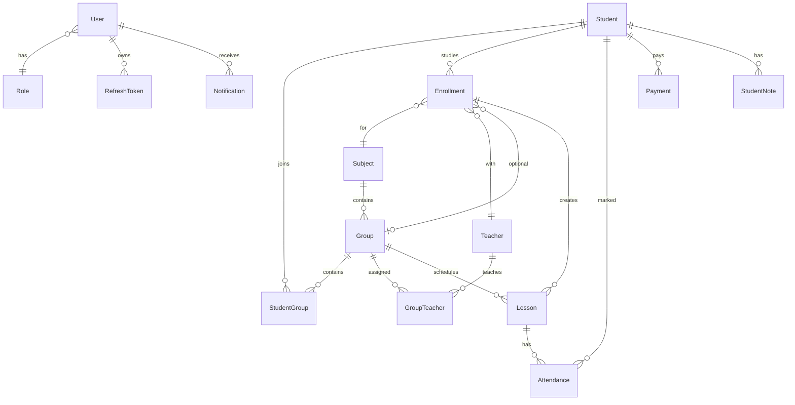

# Study Center CRM Architecture

## Requirements

The platform manages students, enrollments, groups, teachers, subjects, schedule, attendance, payments, notifications and analytics for a training center. It uses JWT authentication with refresh tokens and role-based access control.

## Architecture

The system is a modular monolith:

- `apps/api`: NestJS REST API
- `apps/web`: Next.js web application
- `packages/shared`: shared enums and types
- PostgreSQL stores transactional data
- Prisma owns the database schema and migrations

## Roles

- `ADMIN`: full operational access, users, students, teachers, groups, subjects, schedule, payments and analytics.
- `TEACHER`: own schedule, own students, attendance and teacher-side payment/earnings information.
- `STUDENT`: own schedule, subjects, teachers, attendance and payment status.

Teachers are trusted schedule operators: they can create, move and cancel their lessons directly. Students never see center revenue or other students' data.

## ER Overview

## API

Base path: `/api/v1`

- `POST /auth/login`
- `POST /auth/refresh`
- `POST /auth/logout`
- `GET /auth/me`
- `GET|POST|PATCH|DELETE /users`
- `GET|POST|PATCH|DELETE /students`
- `POST /students/:id/notes`
- `GET /students/:id/history`
- `GET|POST|PATCH|DELETE /enrollments`
- `GET|POST|PATCH|DELETE /teachers`
- `GET /teachers/me/schedule`
- `GET /teachers/:id/schedule`
- `GET /teachers/:id/workload`
- `GET|POST|PATCH|DELETE /subjects`
- `GET|POST|PATCH|DELETE /groups`
- `POST /groups/:id/students`
- `POST /groups/:id/teachers`
- `GET|POST|PATCH|DELETE /lessons`
- `POST /lessons/:id/cancel`
- `POST /lessons/:id/move`
- `GET|POST /attendance`
- `GET|POST|PATCH|DELETE /payments`
- `GET /payments/debts`
- `GET /payments/upcoming`
- `GET /analytics/dashboard`
- `GET /analytics/revenue`
- `GET /analytics/debts`
- `GET /analytics/attendance`
- `GET|POST /notifications`
- `POST /notifications/test-email`
- `POST /notifications/test-telegram`

## Development Plan

1. Infrastructure: monorepo, Docker Compose, PostgreSQL, Prisma.
2. Security: JWT, refresh tokens, RBAC guards, seed roles.
3. CRM core: students, teachers, subjects, groups.
4. Enrollment model: subject, teacher, group/individual format and individual price per student.
5. Learning process: lessons, trusted teacher schedule changes, attendance journal.
6. Finance: payments by enrollment, debts, upcoming due dates.
7. Analytics: revenue, debt and attendance summaries.
8. Notifications: Email and Telegram adapter points.
9. Frontend: admin shell and operational pages.
10. Hardening: tests, audit logging, production deployment settings.
